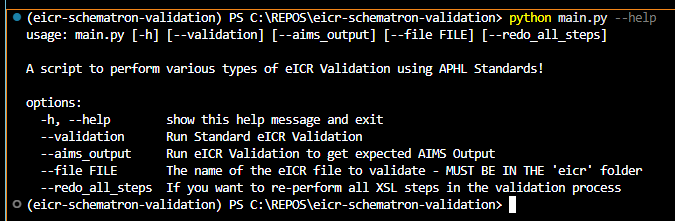

# eICR Validator
## Summary

We have been provided a schematron file that is used by APHL for eICR validation.  Our goal in leveraging this file is to be able to produce expected schematron validation output based upon test/sample eICR messages.  We can then leverage the errors and the eICR messages to validate our functionality to find proper codes and augment them.  Then our team can leverage the same validator, using the provided schematron file, to ensure that our augmented eICR messages meet all requirements.

## Dependencies

**Note these dependencies are handled for this repo at this time, but wanted to make it clear where the files came from**

- [Saxonc-he](https://pypi.org/project/saxonche/)
- [XSLT Files](https://codeberg.org/SchXslt/schxslt/releases/download/v1.10.1/schxslt-1.10.1-xslt-only.zip)
   - Download the zip
   - Extract it locally
   - Copy the `2.0` folder into the `schxslt` folder in this repo/project
- This project uses the [APHL schematron file](./eicr-validator/schematron/) and APHL voc.xml files for validation.  These have been added to this project in the `schematron` folder.  If there are any changes/updates to the APHL validation for TTC these files may need to be updated.

## Schematron Output

The output from the various steps in the eICR validation process are stored here `eicr-validattor/output`.  The final output of either the `validation` or `aims_output` process are stored in a sub folder `eicr-validator/output/result`. 

### Validation Process

To execute the validation process, which is the standard eICR validation against the APHL Schematron file use the `--validation` flag at the command prompt.  The output for this process is still in the *_validation_report.svrl format. 

~~**NOTEThere is more work to do to translate the report.svrl file(s) into the proper XML format that TTC expects from APHL Schematron Error Output.  However, for now this process pathway can suffice as a eicr validation tool to ensure the eicr in question meets the goals of APHL.**~~

### AIMS Output Process

To execute the aims output process, which leverages a manually created file (Stiched_VS_report.xsl) that was 'stiched' together by one of our partners running the schematron validation against a skeleton eicr, use the `--aims_output` flag at the command prompt.  The output will be an XML file that 'should' mirror the expect output from Schematron Validation that occurs within AIMs.

## Execution

- Add any eICR files to the `eicr` folder in the project
- At a terminal at the base of the repo execute `python main.py` with whatever flag choice (see below)
   - You will see the progress of the process
   - The resulting validation report files will be stored in the `output/result` folder with a corresponding name to the eicr file in question.

### Options:
  - -h, --help        show this help message and exit
  - --validation      Run Standard eICR Validation either against EVERY eicr file in the `eicr-validator/eicr` folder or the one specified with the --file flag.
  - --aims_output     Run eICR Validation to get expected AIMS Output either against EVERY eicr file in the `eicr-validator/eicr` folder or the one specified with the --file flag.
  - --file FILE       The name of the eICR file to validate - MUST BE IN THE 'eicr' folder
  - --redo_all_steps  This is ONLY used for the `validation` pathway.  If you want to re-perform all XSL steps in the validation process.  It's recommended you use this option each time.

